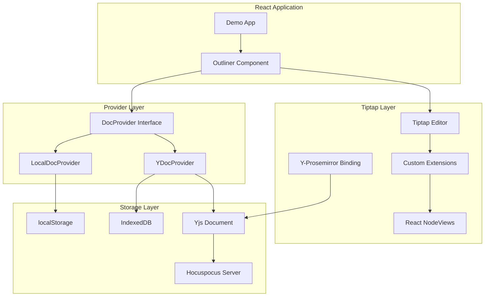

# Design Document

## Overview

The Tiptap Outliner is a production-grade React component library that provides hierarchical list editing with collaborative capabilities. The design follows a provider abstraction pattern to support both local-only and real-time collaborative editing modes. The component is built on Tiptap v3 with custom extensions for outliner-specific functionality, including collapsible items, smart keyboard navigation, and bulk operations.

The architecture is designed for phased delivery:
- **Phase 1**: Local document editing with full keyboard spec and persistence
- **Phase 2**: Collaborative editing with Yjs + Hocuspocus and presence indicators
- **Phase 3**: Performance optimization and mobile support

## Architecture

### High-Level Architecture



### Provider Abstraction

The provider abstraction decouples the Outliner component from specific storage and collaboration implementations:

```typescript
interface DocProvider {
    id: string; // room/document id
    connect(): Promise<void>;
    disconnect(): Promise<void>;
    getJSONSnapshot(): any; // For export/backup
    saveDocumentSnapshot?(docJSON: any): void; // For local-only persistence
    onUpdate(cb: () => void): () => void; // Returns unsubscribe function
    getConnectionState(): 'connected' | 'connecting' | 'disconnected';
    onConnectionStateChange(cb: (state: string) => void): () => void;
}
```

## Components and Interfaces

### Core Components

#### Outliner Component
The main React component that provides the public API:

```typescript
interface OutlinerProps {
    provider: DocProvider;
    initialDoc?: JSONContent | string;
    onChange?: (docJSON: JSONContent) => void;
    readOnly?: boolean;
    className?: string;
    slotRenderers?: {
        itemPrefix?(attrs: any): ReactNode;
        itemSuffix?(attrs: any): ReactNode;
    };
    shortcuts?: Partial<ShortcutConfig>;
    maxDepth?: number; // Default: 8
}
```

#### OutlinerProvider Context
Provides editor instance and commands to child components:

```typescript
interface OutlinerContextValue {
    editor: Editor | null;
    commands: OutlinerCommands;
    provider: DocProvider;
    connectionState: 'connected' | 'connecting' | 'disconnected';
}
```

### Custom Tiptap Extensions

#### OutlinerItem Extension
Extends the base ListItem node with collapse functionality:

```typescript
interface OutlinerItemAttributes {
    collapsed: boolean;
    // Note: level is computed dynamically, not stored as attribute
}

const OutlinerItem = ListItem.extend({
    name: 'outlinerItem',
    addAttributes() {
        return {
            ...this.parent?.(),
            collapsed: {
                default: false,
                parseHTML: element => element.getAttribute('data-collapsed') === 'true',
                renderHTML: attributes => ({
                    'data-collapsed': attributes.collapsed,
                }),
            },
        };
    },
    addNodeView() {
        return ReactNodeViewRenderer(OutlinerItemNodeView);
    },
    // Add transform to efficiently compute levels only when needed
    addProseMirrorPlugins() {
        return [
            new Plugin({
                key: new PluginKey('outliner-levels'),
                appendTransaction: (transactions, oldState, newState) => {
                    // Only recompute levels if document structure changed
                    const structureChanged = transactions.some(tr => 
                        tr.docChanged && tr.steps.some(step => 
                            step.jsonID === 'replaceAround' || step.jsonID === 'replace'
                        )
                    );
                    if (structureChanged) {
                        return updateLevelsTransaction(newState);
                    }
                    return null;
                },
            }),
        ];
    },
});
```

#### CollapsibleList Extension
Handles bullet and ordered lists with collapse semantics:

```typescript
const CollapsibleList = BulletList.extend({
    name: 'collapsibleList',
    addCommands() {
        return {
            toggleCollapse: () => ({ commands }) => {
                return commands.updateAttributes('outlinerItem', {
                    collapsed: !getCollapsedState(),
                });
            },
        };
    },
});
```

#### OutlinerKeymap Extension
Implements all keyboard shortcuts with proper command delegation:

```typescript
const OutlinerKeymap = Extension.create({
    name: 'outlinerKeymap',
    addKeyboardShortcuts() {
        return {
            'Tab': () => this.editor.commands.indentItem(),
            'Shift-Tab': () => this.editor.commands.outdentItem(),
            'Enter': () => this.editor.commands.splitItem(),
            'Shift-Enter': () => this.editor.commands.insertSoftBreak(),
            'Backspace': () => this.editor.commands.handleBackspace(),
            'Delete': () => this.editor.commands.handleDelete(),
            'Ctrl-Enter': () => this.editor.commands.toggleCollapse(),
            'ArrowUp': () => this.editor.commands.moveCursorUp(),
            'ArrowDown': () => this.editor.commands.moveCursorDown(),
            'Alt-ArrowUp': () => this.editor.commands.swapWithPrevious(),
            'Alt-ArrowDown': () => this.editor.commands.swapWithNext(),
            'Ctrl-ArrowUp': () => this.editor.commands.moveSubtreeUp(),
            'Ctrl-ArrowDown': () => this.editor.commands.moveSubtreeDown(),
            'Home': () => this.editor.commands.goLineStartSmart(),
            'End': () => this.editor.commands.goLineEndSmart(),
            'Space': ({ editor }) => {
                if (isAtLineStart(editor.state)) {
                    return editor.commands.indentItem();
                }
                return false;
            },
        };
    },
});
```

### React NodeView Implementation

#### OutlinerItemNodeView
Renders the interactive list item with disclosure triangle and content:

```typescript
const OutlinerItemNodeView: React.FC<NodeViewProps> = ({
    node,
    updateAttributes,
    getPos,
    editor,
}) => {
    const { slotRenderers } = useOutlinerContext(); // Get from React Context
    const hasChildren = hasChildLists(node);
    const collapsed = node.attrs.collapsed;
    const level = computeNodeLevel(node, getPos, editor.state); // Compute dynamically

    return (
        <li
            data-testid="outliner-item"
            data-collapsed={collapsed}
            data-level={level}
            className={`outliner-item level-${level}`}
        >
            <div className="outliner-item-content">
                {hasChildren && (
                    <button
                        role="button"
                        aria-expanded={!collapsed}
                        className="disclosure-triangle"
                        onClick={() => updateAttributes({ collapsed: !collapsed })}
                    >
                        {collapsed ? '▶' : '▼'}
                    </button>
                )}
                
                {slotRenderers?.itemPrefix?.(node.attrs)}
                
                <NodeViewContent
                    className="outliner-item-text"
                    as="div"
                />
                
                {slotRenderers?.itemSuffix?.(node.attrs)}
            </div>
            
            <NodeViewWrapper
                className={`outliner-item-children ${collapsed ? 'collapsed' : ''}`}
            />
        </li>
    );
};
```

## Data Models

### Document Structure
The document follows Tiptap's JSON structure with custom attributes:

```typescript
interface OutlinerDocument {
    type: 'doc';
    content: [
        {
            type: 'collapsibleList';
            content: OutlinerItemNode[];
        }
    ];
}

interface OutlinerItemNode {
    type: 'outlinerItem';
    attrs: {
        collapsed: boolean;
        level: number;
    };
    content: [
        {
            type: 'paragraph';
            content: TextNode[];
        }
    ];
}
```

### Provider Implementations

#### LocalDocProvider
Handles single-user persistence with localStorage:

```typescript
class LocalDocProvider implements DocProvider {
    private storageKey: string;
    private updateCallbacks: Set<() => void> = new Set();
    private saveTimeout: NodeJS.Timeout | null = null;
    
    constructor(id: string, storageKey?: string) {
        this.id = id;
        this.storageKey = storageKey || `outliner-${id}`;
    }
    
    async connect(): Promise<void> {
        // Load from localStorage if available
        const saved = localStorage.getItem(this.storageKey);
        if (saved) {
            this.notifyUpdate();
        }
    }
    
    getJSONSnapshot(): any {
        const saved = localStorage.getItem(this.storageKey);
        return saved ? JSON.parse(saved) : null;
    }
    
    saveDocumentSnapshot(docJSON: any): void {
        // Debounced save to localStorage
        if (this.saveTimeout) {
            clearTimeout(this.saveTimeout);
        }
        this.saveTimeout = setTimeout(() => {
            localStorage.setItem(this.storageKey, JSON.stringify(docJSON));
        }, 800);
    }
}
```

#### YDocProvider
Handles collaborative editing with Yjs:

```typescript
class YDocProvider implements DocProvider {
    private ydoc: Y.Doc;
    private provider: HocuspocusProvider;
    private awareness: Awareness;
    
    constructor(id: string, wsUrl: string) {
        this.id = id;
        this.ydoc = new Y.Doc();
        this.provider = new HocuspocusProvider({
            url: wsUrl,
            name: id,
            document: this.ydoc,
        });
        this.awareness = this.provider.awareness;
    }
    
    async connect(): Promise<void> {
        return new Promise((resolve, reject) => {
            const timeout = setTimeout(() => {
                reject(new Error('Connection timeout'));
            }, 10000);
            
            this.provider.on('connect', () => {
                clearTimeout(timeout);
                resolve();
            });
            
            this.provider.on('disconnect', () => {
                // Handle disconnection via onConnectionStateChange, not here
                this.connectionStateCallbacks.forEach(cb => cb('disconnected'));
            });
            
            this.provider.connect();
        });
    }
    
    getJSONSnapshot(): any {
        // Convert Y.Doc to JSON for export
        return yDocToProsemirrorJSON(this.ydoc);
    }
}
```

## Error Handling

### Connection States
The system handles three connection states with appropriate UI feedback:

1. **Connected**: Normal operation, no indicators
2. **Connecting/Reconnecting**: Subtle loading indicator
3. **Disconnected**: Warning banner with retry option

### Conflict Resolution
For collaborative editing, conflicts are resolved using Yjs CRDT semantics:

- **Text conflicts**: Automatic merge using Yjs CRDT algorithms
- **Structural conflicts**: Last-writer-wins based on Lamport clocks
- **Collapsed state conflicts**: Last-writer-wins (most recent update wins)

### Error Recovery
- **Network failures**: Automatic reconnection with exponential backoff
- **Fatal errors**: Non-blocking toast with "Download backup" option
- **Storage failures**: Graceful degradation to memory-only mode

## Testing Strategy

### Unit Tests (Vitest)
Test individual commands and transforms in isolation:

```typescript
describe('indentItem command', () => {
    it('should indent item within maxDepth limit', () => {
        const { editor } = createTestEditor();
        editor.commands.setContent(createTestDoc());
        editor.commands.indentItem();
        expect(getItemLevel(editor.state)).toBe(1);
    });
    
    it('should be no-op at maxDepth', () => {
        const { editor } = createTestEditor({ maxDepth: 2 });
        setItemAtLevel(editor, 2);
        editor.commands.indentItem();
        expect(getItemLevel(editor.state)).toBe(2);
    });
});
```

### Integration Tests (React Testing Library)
Test React component behavior and user interactions:

```typescript
describe('Outliner component', () => {
    it('should render disclosure triangle for items with children', () => {
        render(<Outliner provider={mockProvider} initialDoc={docWithChildren} />);
        expect(screen.getByRole('button', { name: /expand/i })).toBeInTheDocument();
    });
    
    it('should handle Tab key for indentation', async () => {
        const user = userEvent.setup();
        render(<Outliner provider={mockProvider} />);
        
        await user.type(screen.getByRole('textbox'), 'Test item');
        await user.keyboard('{Tab}');
        
        expect(screen.getByTestId('outliner-item')).toHaveAttribute('data-level', '1');
    });
});
```

### E2E Tests (Playwright)
Test complete user workflows including collaborative scenarios:

```typescript
test('collaborative editing with two users', async ({ browser }) => {
    const context1 = await browser.newContext();
    const context2 = await browser.newContext();
    
    const page1 = await context1.newPage();
    const page2 = await context2.newPage();
    
    await page1.goto('/demo?room=test-room');
    await page2.goto('/demo?room=test-room');
    
    // User 1 types content
    await page1.fill('[data-testid="outliner-item"] [contenteditable]', 'Hello from user 1');
    
    // User 2 should see the content
    await expect(page2.locator('[data-testid="outliner-item"]')).toContainText('Hello from user 1');
    
    // Test collapse state synchronization
    await page1.click('.disclosure-triangle');
    await expect(page2.locator('[data-testid="outliner-item"]')).toHaveAttribute('data-collapsed', 'true');
});
```

### Test Data and Utilities
Provide comprehensive test utilities for consistent testing:

```typescript
export const createTestDoc = (items: string[] = ['Item 1', 'Item 2']) => ({
    type: 'doc',
    content: [{
        type: 'collapsibleList',
        content: items.map(text => ({
            type: 'outlinerItem',
            attrs: { collapsed: false, level: 0 },
            content: [{ type: 'paragraph', content: [{ type: 'text', text }] }]
        }))
    }]
});

export const createTestEditor = (options = {}) => {
    const provider = new MockDocProvider();
    return {
        editor: new Editor({
            extensions: [
                StarterKit,
                OutlinerItem,
                CollapsibleList,
                OutlinerKeymap,
            ],
            content: createTestDoc(),
            ...options,
        }),
        provider,
    };
};
```

## Performance Considerations

### Rendering Optimization
- Use React.memo for NodeView components to prevent unnecessary re-renders
- Batch DOM updates using requestAnimationFrame for bulk operations
- Target performance: smooth operation up to 500 items (realistic scope for Phase 1-2)

### Memory Management
- Clean up event listeners and subscriptions in useEffect cleanup
- Debounce expensive operations like persistence and presence updates
- Use WeakMap for caching computed values tied to editor state

### Network Optimization
- Compress Yjs updates before transmission
- Implement presence update coalescing to reduce network traffic
- Use IndexedDB for offline caching to reduce server load

This design provides a solid foundation for building a production-grade Outliner component that meets all the specified requirements while maintaining flexibility for future enhancements.